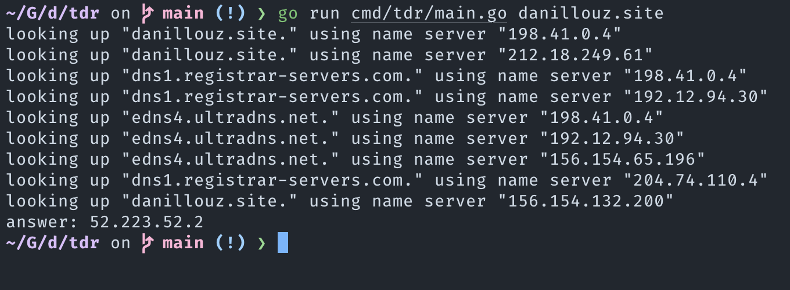

# tdr

Tiny DNS resolver.

Work in progress; you can try it by cloning it and running something like:

```
go run cmd/tdr/main.go danillouz.dev
```



## Resources

- [RFC 1034](https://datatracker.ietf.org/doc/html/rfc1034)
- [RFC 1035](https://datatracker.ietf.org/doc/html/rfc1035)
- [A toy DNS resolver](https://jvns.ca/blog/2022/02/01/a-dns-resolver-in-80-lines-of-go/)
